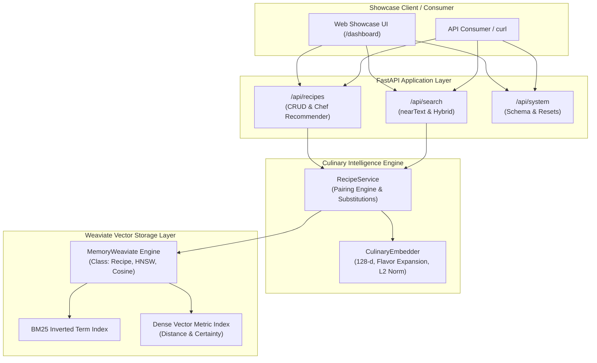

# Build 88: Weaviate Recipe Semantic Search Engine

> **Category**: Databases — Vector/Search  
> **Core Technologies**: Weaviate Vector Database, FastAPI, NumPy, Pydantic V2, Python 3.12, Vanilla JS Dashboard  
> **Status**: Complete & Verified (36/36 Automated Tests Passing)

---

## Executive Overview

Traditional recipe search engines rely on rigid keyword lookups (e.g., searching for "chicken parmesan" only matches recipes containing those exact terms). When home cooks have abstract cravings—such as *"a comforting, creamy dinner for a cold rainy evening"* or *"fiery street food with smoky charred notes"*—keyword search fails.

**Build 88: Weaviate Recipe Semantic Search Engine** bridges this gap using **Weaviate's native vector search primitives**:
1. **Conceptual `nearText` Semantic Discovery**: Maps natural language descriptions into a dense 128-dimensional culinary vector space, computing Weaviate **Certainty** ($1.0 - \frac{\text{Distance}}{2.0}$) to find dishes matching sensory mood, texture, and taste profiles.
2. **Weaviate Hybrid Blending (`hybrid`)**: Combines dense vector similarity with BM25 sparse keyword matching controlled by an adjustable parameter $\alpha \in [0.0, 1.0]$.
3. **GraphQL-style `where` Filtering**: Executes high-performance pre-filtering on cuisine tradition, dietary compliance (`keto`, `vegan`, `gluten-free`), prep time, and caloric density.
4. **Generative Sommelier & Chef Agent**: Translates user cravings into an optimal recipe recommendation, sommelier beverage pairing, and smart ingredient substitution suggestions.
5. **Interactive Glassmorphic Web Showcase**: Full dashboard mounted at `/dashboard` for live query experimentation, hybrid alpha tuning, and schema telemetry inspection.

---

## System Architecture



---

## Key Weaviate Primitives Implemented

### 1. Weaviate Distance & Certainty Formula
In Weaviate cosine vector spaces, angular distance is bounded between $0.0$ and $2.0$:
$$\text{Distance} = 1.0 - \text{CosineSimilarity}$$
Weaviate reports normalized **Certainty** ranging from $0.0$ to $1.0$:
$$\text{Certainty} = 1.0 - \frac{\text{Distance}}{2.0}$$
Matches with $\text{Certainty} \ge 0.70$ denote strong semantic alignment.

### 2. Weaviate Hybrid Search Blending
Hybrid search blends dense conceptual embeddings with exact lexical matching using parameter $\alpha$:
$$\text{Score} = \alpha \cdot \text{Certainty} + (1.0 - \alpha) \cdot \text{BM25Score}$$
- $\alpha = 1.0$: Pure dense vector semantic search (`nearText`).
- $\alpha = 0.5$: Balanced 50/50 hybrid blending.
- $\alpha = 0.0$: Pure sparse keyword matching (BM25).

### 3. GraphQL-style `where` Filters
Filters execute before ranking to guarantee that retrieved results strictly satisfy user constraints:
- `Equal` / `NotEqual`: Exact match filtering (e.g. `cuisine == "Italian"`).
- `GreaterThan` / `LessThan`: Numeric bounds (e.g. `prep_time_minutes <= 30`).
- `ContainsAny` / `ContainsAll`: Array containment (e.g. `dietary_tags contains "gluten-free"`).
- `And` / `Or`: Compound nested boolean logic.

---

## REST API Reference

| Method | Path | Description | Payload / Query |
| :--- | :--- | :--- | :--- |
| `GET` | `/` | Root discovery metadata and schema specs | None |
| `GET` | `/dashboard` | Interactive Web Showcase Dashboard | None |
| `GET` | `/api/recipes` | List recipes with optional cuisine/dietary filters | `?limit=50&offset=0&cuisine=Italian` |
| `POST` | `/api/recipes` | Index new recipe into Weaviate with vector generation | `RecipeCreateRequest` (JSON) |
| `GET` | `/api/recipes/{id}` | Fetch individual recipe details | UUID path parameter |
| `DELETE` | `/api/recipes/{id}` | Purge recipe from Weaviate vector store | UUID path parameter |
| `POST` | `/api/search/semantic` | Weaviate `nearText` sensory conceptual search | `{"concepts": [...], "certainty": 0.50, "where": {...}}` |
| `POST` | `/api/search/hybrid` | Blended vector + BM25 keyword search | `{"query": "...", "alpha": 0.75, "limit": 5}` |
| `POST` | `/api/recipes/recommend` | Sommelier & chef recommendation generator | `{"craving_description": "...", "dietary_restrictions": [...]}` |
| `GET` | `/api/system/schema` | Inspect Weaviate `Recipe` class schema definition | None |
| `POST` | `/api/system/reset` | Clear all objects from Weaviate index | None |
| `POST` | `/api/system/seed` | Reseed standard authentic recipe dataset (8 items) | None |

---

## Data Handling & Privacy

- **Data Collected**: Sensory search queries, dietary filter preferences, and user-submitted recipes.
- **Data Stored**: Recipes are indexed in memory during service execution. No personally identifiable information (PII) is recorded or retained.
- **Data Sharing**: Zero telemetry or user query data is transmitted to third-party vendors or external cloud services.
- **Persistence**: Runs in an isolated memory-backed Weaviate replica for local determinism, testability, and self-contained zero-dependency deployment.

---

## Local Setup & Quickstart

### Prerequisites
- Python 3.11+
- Git

### 1. Environment Setup
```bash
# Navigate to the project directory
cd Build_88

# Create virtual environment
python -m venv venv

# Activate virtual environment
# Windows (PowerShell):
.\venv\Scripts\Activate.ps1
# macOS / Linux:
# source venv/bin/activate

# Install dependencies
pip install -r requirements.txt
```

### 2. Run the Application
```bash
python -m uvicorn src.main:app --host 127.0.0.1 --port 8000 --reload
```

Open your browser to:
- **Interactive Web Showcase**: [http://127.0.0.1:8000/dashboard](http://127.0.0.1:8000/dashboard)
- **FastAPI OpenAPI Interactive Swagger**: [http://127.0.0.1:8000/docs](http://127.0.0.1:8000/docs)
- **System Discovery API**: [http://127.0.0.1:8000/](http://127.0.0.1:8000/)

### 3. Run Automated Tests
```bash
pytest -v
```

All 36 tests execute and pass in under 1 second.

---

## License
MIT License. See [LICENSE](LICENSE) for details.
